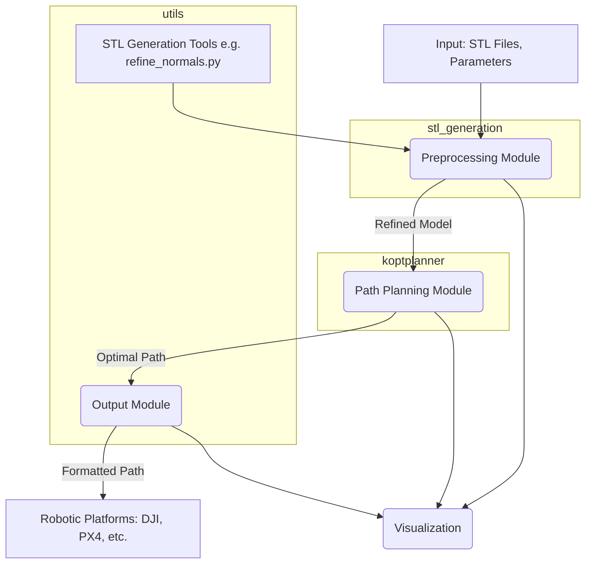

# System Patterns

## System Architecture (High-Level Overview):

*   **Input Module:** Handles loading and validation of 3D models (primarily STL) and inspection parameters.
*   **Preprocessing Module:** Cleans, refines, and prepares 3D models for path planning. This includes tasks like:
    *   Normal vector calculation and refinement (current area of focus with `refine_normals.py`).
    *   Mesh simplification/decimation.
    *   Identification of inspection surfaces.
*   **Path Planning Module:** Core engine that generates optimal inspection paths. This might involve:
    *   Coverage path planning (CPP) algorithms.
    *   Traveling Salesperson Problem (TSP) solvers (e.g., LKH as seen in `koptplanner/include/LKH-2.0.7/`).
    *   Collision detection and avoidance.
    *   Consideration of vehicle dynamics and sensor constraints.
*   **Output Module:** Formats and exports the generated paths for various robotic platforms (e.g., DJI, PX4, RotorS, as seen in `utils/ExportTo...` directories).
*   **Visualization Module:** Provides tools to visualize models, paths, and sensor coverage (e.g., Rviz, MATLAB scripts like `request/visualization/inspectionPathVisualization.m`).

## Key Technical Decisions (Inferred & To Be Confirmed):

*   **Primary 3D Model Format:** STL appears to be the primary format, with scripts dedicated to its processing.
*   **Modularity:** The project seems to be structured into modules (e.g., `koptplanner`, `optec`, `stl_generation`, `utils`).
*   **Use of External Libraries:**
    *   LKH for TSP solving.
    *   Potentially others for geometry processing, numerical optimization (`optec` seems to be an optimization library).
*   **Cross-Platform Considerations:** Makefile variations (`make_cygwin.mk`, `make_linux.mk`, etc.) suggest an effort for cross-platform compatibility.
*   **ROS Integration:** The presence of `catkin_ws_repos`, `package.xml`, `.launch` files, and `rviz` strongly indicates a ROS (Robot Operating System) based environment.

## Design Patterns (To Be Identified):

*   *(This section will be populated as patterns are identified in the codebase.)*
*   Example: Observer pattern for updating UI on planning progress.
*   Example: Strategy pattern for selecting different path planning algorithms.

## Component Relationships (Initial Sketch):

*This diagram is a preliminary sketch and will be refined as more is understood about the system.*
